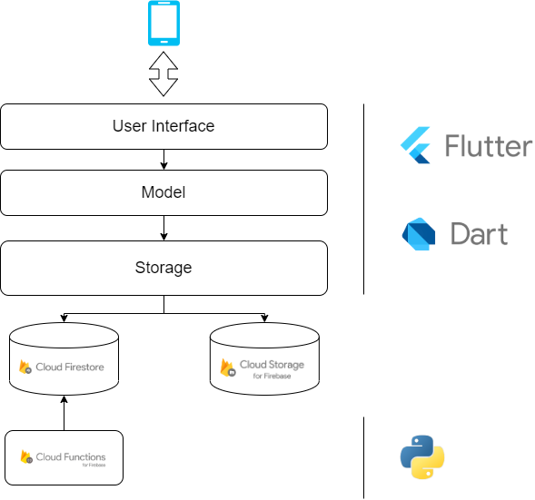

# GATECH cs4261 Mobile App & Svcs Project

## Problem Overview
Students on Georgia Tech’s campus are always looking for some kind of recreational activities, but those need groups of people to do. We are addressing the issues surrounding group forming and coordination for team-based sports.

### Past Solution Breakdown
| Solution | Essential Elements | Shortcomings |
|------------------------|------------------------------------------------------------|-----------------------------------------------------------------------------------------------------------------------------------------------------------------------------------------------------------|
| Interest Groups / CCAs | 1. Common Interests 2. Commitment 3. Skilled players | 1. Fixed commitment - students’ schedules vary a lot 2. Students’ with interest may not be able to make the cut for trails 3. Students’ may not be aware of their existence if outreach is not good |
| Meetup.com | 1. Only event base commitment 2. Common interests | 1. Strangers with unverified identity may not be safe 2. May be difficult to travel to the location for tech students |
| Social Media | 1. Common interests | 1. Students’ may not be aware of how to find these groups |

Our project aims to be able to **connect students with common interest in a particular sport on a specific timeframe to create instantaneous groups for pickup games of various sports**.

## Architecture

## References & Technologies
* Flutter for cross platform development
* Android Studio as the development environment
* GitHub for version control and issue tracking
* Firebase as the backend queue system
* GroupMe for communication

